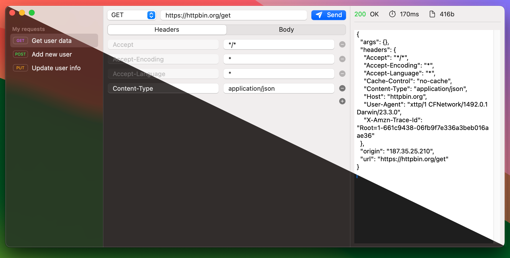

# Xttp

## A lightweight HTTP client written in Swift

## Features

* ✅ 100% macOS native
* ✅ Instant boot
* ✅ No accounts required

## Roadmap

This obviously is not ready for production and have many more features to go. Some of them are:
* 📥 Better JSON visual formatting
* 📥 Import and Export requests
* 📥 HTML Preview
* 📥 WS Support
* 📥 Bug fixes
* 📥 iPad app
* 📥 Shortcuts integration

## Why?
I hate greedy, electron based HTTP clients: they're heavy and takes a long time to boot. 
I just want to use something light and that doesn't require an account or signature to use it after I finished my migration.

Still WIP. Help me to catch bugs and make this run smoother.
